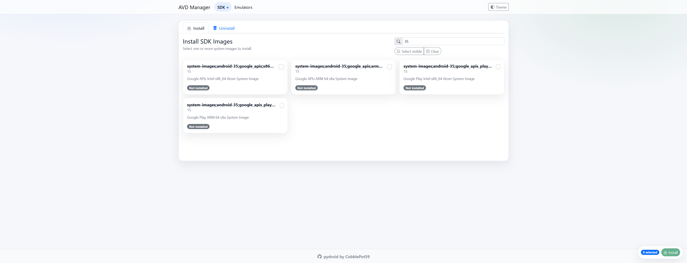
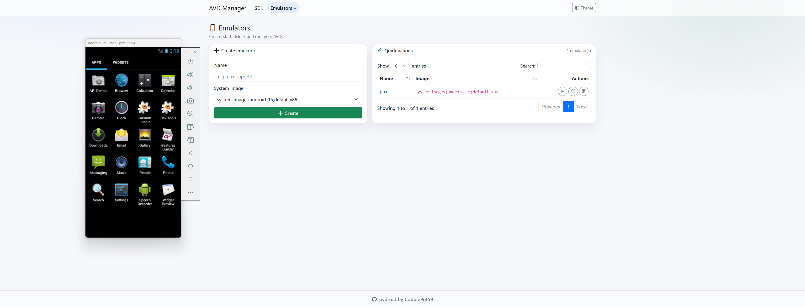

# pydroid
Manage your sdks and emulators in a light and simplified way using a webui.

## Prerequisites
Install java runtime environment [(https://adoptium.net/temurin/releases/?version=17)](https://adoptium.net/temurin/releases/?version=17)

## Installation / Configuration
1) Download this project.
```
git clone https://github.com/CobblePot59/pydroid.git
```
2) Go to pydroid folder
```
cd pydroid
```
3) Download libraries
```
python3 -m pip install -r requirements.txt
```
4) Run as administrator
```
python3 main.py
```

## Install SDK


## Start emulator

